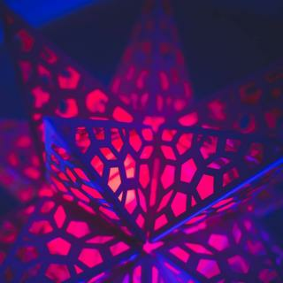
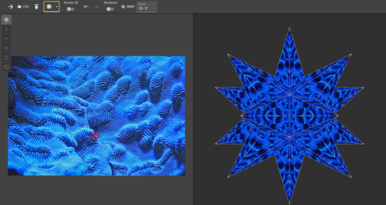

# SVG widgets

This web application used to go by the name Polyhedz Studio which is now deprecated in order to avoid confusion with SVG Widget Studio which will become a more general-purpose framework for creating parameterized exportable SVG with automated UI generation data models.

## Polyhedral Nets

 Interlocking pyramid nets that form stellations and other geometric polyhedra. Flat panels become pyramids and pyramid collections are connected to become spherical star-like shapes. These shapes have been produced under the banner of [Playful Geometer](https://www.facebook.com/playful.geometer).  In the past, the dielines (cut/score vector paths) for these shapes were manually created with Inkscape. Modifying the tab system  was a tedious task that made design iteration difficult.  

Previously this app was a [desktop application](https://github.com/justin-hackin/polyhedz-studio/releases/latest) but it has since been ported to a [web application](https://polyhedz-studio.vercel.app). Note the default branch is `web` whereas the legacy Electron app exists on `master`. 

|  |  |
|----------------------------------------------------------------------------------------------|---------------------------------------------------------------------------------------------------------|


This app consists of 2 main sections:

### Design Area

|  |  |
|---------------------------------------------------------------------------------|---------------------------------------------------------------------------------|


Allows viewing of the SVG dielines and optional print layer with controls for adjusting every aspect of the design. Each pyramid net consists of several component parts

- **Ascendant edge**: these are the tabs that connect 2 disjunct faces together, allowing it to become a pyramid
- **Base edge**: these are the tabs that allow the pyramids to interlock into a spherical configuration
- **Face decoration**: an optional print or cut pattern applied to the shape's faces

#### Features

- Modify all parameters that compose the dielines with reasonable slider value ranges
- Break outside the suggested slider range with with text input toggle, enabling precision adjustment and non-standard settings exploration (use with caution)
- Choose your preferred unit of display/input in settings, measurement data is saved in unit-agnostic pixels (96dpi)
- Supports fractional display/input of inches or cm
- User settings persisted across sessions
- View print/cut components separately with the Assets accordion
- Save the dielines file and optional print file SVG alongside a .pns file that will allow you to re-open your parameter settings later
- Image-based textures are exported as separate file
- Image registration modes
    - Laser cutter: cut registration marks onto the laser cutter bed, trim print to expose its registration corners, and line up the print with the bed
    - Craft Robo: export a bounding box in dielines for use with Craft Robo Pro Illustrator plugin
- Test tabs' connections efficiently without having to cut out a whole pyramid
- Break a single pyramid net up into multiple sections (nets per pyramid), allowing maximum shape size with limited cutting area
- View test tabs via multi-widget interface
- Download/import SVG template for editing cut paths with your own vector editor of choice as an alternative to texture editor

### Texture Editor

|  |  |
|---------------------------------------------------------------------------------|---------------------------------------------------------------------------------|
|                                                                                 |                                                                                 |

Interactively apply cut patterns or print textures to the faces of your shape and see a 3D preview of the resultant shape

#### Features
- Path textures (imports only topmost `<path>` of selected SVG file)
- Use path fill as holes (negative) or material (positive)
- Path automatically clipped to dieline faces, insetting the pattern to prevent appearance of ascendant edge flap
- Flexible texture arrangement interface: adjust scale, rotation, zoom with modifier keys + mouse wheel OR vertical drag
- Lock dragging horizontally or vertically
- Snap texture + origin
- Snap origin/nodes to face corners/center
- Image textures
- Optional black border obscures shadows casted by ascendant edge tabs
- Shape preview border width syncs with ascendant edge tabs thickness
- Export GLB files of 3D preview (compatible with Mozilla Hubs)
- Intelligent defaults for all files names (encodes shape name and texture file name)


This application was originally designed only for creating polyhedral nets, it has been extended to enable multiple design "widgets". 

### Cylinder Lightbox
<p alt="cylinder lightbox" align="center">
  
</p>

An open polygon prism box with ring-shaped sleeve edges. This allows one to efficiently construct a (roughly) cylindrical form out of flat panels. It has been used to create circular LED lightboxes. 

This widget has a different UI configuration in the Assets accordion known as a "Disjunct Asset Definition" (as opposed to the "Registered Asset Definition" of the pyramid net). The different assets of the design can either be viewed all at once, or independently. This allows the user to see all changes to any widget parameter but also examine each component independently with less clicks than the per-asset visibility toggle. 

### Grid dividers

<p alt="crosshatch shelf" align="center">
  
</p>
Enables the creation of slotted cross-hatched shelving inserts. Target application: spatial organization, storage of many bottles and/or cans within larger shelf section, collectibles box divider.

## Warning

This is an alpha stage project with some known bugs and lacking features as listed in the [project board](https://github.com/justin-hackin/polyhedz-studio/projects/1).

KDE users will experience issues with Alt-dragging modifiers in Texture Editor due to the window manager's default behaviour, see [this post](https://superuser.com/questions/584730/how-can-i-disable-alt-mouse-default-behavior-in-kde) for a fix.

## Developer notes

To start its dev server, do:
```
npm run watch
```

or to run the production version of the app do:

```
npm run build && npm run serve-build
```

Changes to the `web` branch will cause the [Vercel-hosted web application](https://polyhedz-studio.vercel.app) to redeploy.

## Author's note
 
These designs are a labor of love for symmetry and craft developed over many years of play and toil. I offer them in the spirit of generosity and mutual care. It would bring me joy to see these manifestations spread with these intentions preserved. Please respect the [Creative Commons Attribution-NonCommercial-ShareAlike](https://creativecommons.org/licenses/by-nc-sa/4.0/) license under which the resultant content is under or please reach out if you would like to be granted further rights to use these designs. Collaborators are welcomed.
